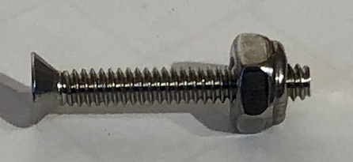

## Build instructions  
*These instructions assume a moderate level of mechanical ability.*  

****
### Tool list
*Links are examples, not necessarily recommendations.*
+ [Wrench](http://a.co/dhmqmTd) for #6 and M8 nuts.  
[Or this one is excellent if you like tools...](http://a.co/dgSMBE6)
+ Phillips Screwdriver
+ [Prick Punch](http://a.co/i7NIDQO) or large, sharp nail.
+ [Utility Knife](http://a.co/hBduSda)
+ [Metal Ruler / Straight Edge](http://a.co/el4EUwV) for cutting.
+ [Small level](http://a.co/83ioinS)
+ Small measuring tape, or ruler
+ [3/8" Power Drill](http://a.co/dUaUAev)
+ [9/64" & 5/16" Drill Bits](http://a.co/5akXGcT)  
+ [Hole saw](http://a.co/hhBEFcI) To cut a clean hole for cables in the project box.

See [parts list](./parts_list.md) for materials.  

****
### Raspberry Pi, Sense Hat & Zebra Case Assembly

Follow the instructions included with the case.  
The finished product should look like this:  

   
  

****
### Mounting plates

   

+ Print a copy of the template from the /template directory of the project.  
*Measure the objects in the printout to ensure a 1:1 print scale*
+ The template has sets of four mounting plates laid out in a block.  
+ Lay the template on your 1/8" UHMW Plastic Sheet  
*Feel free to use other media.  [Aluminum](http://a.co/9ri0TRB) would work well if you know how to work with it.*  
*We chose UHMW plastic because it is stiff, strong and easy to work with.*  
*Our UMHW sheet had a warp to it that did not affect the outcome of the project.*  
+ Use the prick punch or nail to mark the corners of the rectangles for your cuts.  
+ Similarly mark the centers of the drill-holes.  
Deeper indentations will help keep the drill bit from 'walking'.  
+ Drill out the holes in the mouting plates.  
*Note that one of the 5/16" holes should be vertically elongated to allow for level adjustment later.*
+ Use a straight edge and utility knife to cut out the four mounting plates.  
*Start with an initial, very light cut, then apply more pressure for each successive cut*    
*This method is safer, and more effective.*
+ Black UMHW whitens if you sand it.  If you want to clean up rough edges I found that a [heat gun](http://a.co/92F7YUe) works well.   
*Be careful not to heat the UMHW to the point of shrinking or warping.*

****
### Zebra case bolt assemblies

  

+ Get the #6 screws, washers, lock nuts & nuts.
+ One of the lock nuts in each of the 8 identical assemblies is threaded on nylon-side-first.  
To make this step easier pre-cut threads into the nylon by first threading it on the 'normal' way, then removing it from the screw.  

+ Assemble as shown in the first image in this section.  
+ Attach the bolt assemblies to the mounting plates as shown below.    
With the last lock nut and washer on back side of the mounting plate.  
The screw-ends should be flush with the end of the nut on the back side of the mounting plate.  
*Note that there is a front and back to the mounting plate.*   
*The smaller bolt assemby holes are offset to the left when facing the front of the mounting plate.*   
+ Tighten the lock nuts sandwiching the mounting plate.  (Use two wrenches for best results.)  
+ The standard nut (closest to the bolt head) should be able to turn freely.  

+ Test the spacing of the mounting plate bolt assemblies by sliding into the wall-mount holes on the back of the case.  

 

****
### Cable clamp assembly & mounting

+ Gather the 4 cable clamps, 8 M8 washers & 8 M8 lock nuts.    

****
### Mount cable clamps to lab stand

+ Slide the cable clamps on to the top of the lab stand post.
+ Space evenly with the top clamp at the very top of the lab stand post.
+ The Zebra cases are 2.75" so to have a 1.5" gap between them, I spaced the clamps 4.75" apart.  
+ Finger tighten the clamp nuts while you space and align the clamps.  
+ Tighten fully once you are satisfied with the result.  
*Note:  Moving the clamps later will require some dissasembly.*  

   

****
### Attach mounting plates to cable clamps

+ Slide mounting plate on to clamp bolts.  
+ Install M8 washers and lock nuts.
+ Tighten nuts securely, but loose enough to rotate the mounting plate for levelling.  

  
  

+ Level the mounting plate by resting the level on the bolt heads, not the plate top.  
+ Once levelled, fully tighten the lock nuts.  

+ Mount the Zebra case on to the mounting plate.  
+ Tighten the standard nut and washer against the case back to secure the case.  

   

****
### Stand pre-cabling

****
### Cabling and cable management
 
+ Cut the cable management sleeve to match the height of the stand post.  
+ Singe the cut ends lightly with a candle or lighter to help prevent fraying.  
+ Wrap the cable management around the stand post.  
+ For a cleaner fit, cut triangle shaped wedges where the cable management meets the cable clamps. 
+ Singe the cuts to prevent fraying.  

+ We found that two layers of cable management looked better.  
Repeat the steps above to wrap a second layer on to the post.  
+ Attach the usb power cables and optional ethernet cables to the Raspberries.  
+ Starting from the top, push the cables between the two layers of cable management.  
+ When complete, wrap zip ties around the outside of the post & cable management  
behind the Raspberries where they can't be seen.  
+ Zip tie the cables together where they egress the bottom of the cable management. 

 
****
### Box for USB power, switch and cables

+ You need a relatively large (8"Lx5.5W"x4H") box to contain all the extra cables.
+ This size also matches the 8"x5.5" footprint of the lab stand so it can sit under the stand.
+ Drill a ~1.5" hole in the end of the box for cable ingress and egress.

  

****
### Done!

